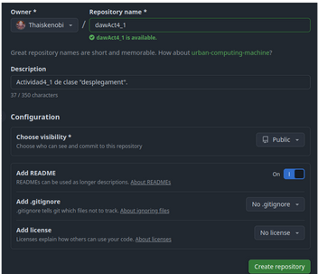

# Actividad 1.3 Trabajando con un Repositorio Remoto en GitHub

## **1. Creando el escenario**

>Crea un nuevo repositorio. 

## **2. Puesta a punto de cliente en un contenedor**

>_Configuración del repositorio_

1. Crea un contenedor con una imagen de Ubuntu 24.04  y llámale “gitclient”:

`sudo docker run -it --name gitclient ubuntu:24:04`

2. Creamos la clave:
   
`ssh-keygen -t ed25519 -C "tucorreo@gmail.com"`

## 3. Mas información

[Tutorial con imagenes](https://docs.google.com/document/d/1PA7mU8IW8OI9BPckgRxIe8p3LkF2GkcR9HME1DU-XYI/edit?tab=t.0)
